# Procesverslag
**Auteur:** Sanne Oosterhof

**De opdrachten:** [opdracht 1](opdracht1/index.html) en [opdracht 2](opdracht2/index.html)

Markdown is een simpele manier om HTML te schrijven.  
Markdown cheat cheet: [Hulp bij het schrijven van Markdown](https://github.com/adam-p/markdown-here/wiki/Markdown-Cheatsheet).

Nb. De standaardstructuur en de spartaanse opmaak van de README.md zijn helemaal prima. Het gaat om de inhoud van je procesverslag. Besteedt de tijd voor pracht en praal aan je website.

Nb. Door *open* toe te voegen aan een *details* element kun je deze standaard open zetten. Fijn om dat steeds voor de relevante stuk(ken) te doen.

## Bronnenlijst
  1. https://codepen.io/shooft/pen/vYVjLvy  
  2. https://bennettfeely.com/clippy/
  3. https://www.fontsquirrel.com/tools/webfont-generator
  4. https://swiperjs.com/get-started 
  5. https://codepen.io/shooft/pen/GRXMEoV
  6. https://swiperjs.com/get-started#add-swiper-html-layout 
  7. https://css-tricks.com/snippets/css/complete-guide-grid/ 
  8. https://codepen.io/shooft/pen/rNdoWQZ 
  9. https://emojiterra.com/fr/sueurs-froides/ 

## Opdracht 1 plan

  
uitwerken na schetsen idee (voor week 2)

  ### Je storyboard:
  

  ### Je ambitie: 
  Aan deze technieken/punten wil ik werken:
  - Het vergroten van letters
  - De kenmerkende driehoek van Fanta onder de tekst laten verschijnen
  - De letters vol laten stromen
  - Een mooi dark/light schema ontwerpen
 

## Opdracht 1 reflectie

  
uitwerken bij afronden opdracht (voor week 4)

  ### Je uitkomst - karakteristiek screenshot(s):
  

  ### Dit ging goed/Heb ik geleerd: 
  Voor mij waren keyframes nog helemaal nieuw, hier heb ik dus veel van geleerd. 
  Keyframes gebruiken was eigenlijk makkelijker dan ik had gedacht, het is meer werk geweest voor mij om alles goed op elkaar af te stemmen.
  Denk bijvoorbeeld aan het vol laten stromen van de letters, de laatste A is eerder vol dan de andere letters. 
  Dit was niet moeilijk om te doen, maar vooral veel uitproberen en testen. 
  Zo heb ik uiteindelijk alle letters goed op elkaar kunnen afstemmen met het volstromen, dit ging best goed. 
  Ook vond ik het erg leuk om mijn eerste eigen animatie te maken en ontwerpen.
  Voordat ik begon met coderen voor opdracht 1 wist ik niet dat mijn animatie eigenlijk uit 3 losse animaties bestaat.
  Wat ik hiervan heb geleerd is om vooraf al beter te bepalen wat samen kan en wat los van elkaar komt te staan. 
  Nadat ik een storyboard had gemaakt kwam ik er al snel achter dat ik nog wat extra uitdaging zocht en met een before of after aan de slag wilde gaan. 
  Uiteindelijk heb ik een after gebruikt, waar ik voorheen nog nooit mee gewerkt had. 
  Vooraf dacht ik dat het veel moeilijker zou zijn om met een before/after te werken, maar dit vond ik erg meevallen. 
  Ik ben erg blij met het eindresultaat en had niet gedacht dat het toch zo mooi zou worden.

  
  

  ### Dit was lastig/Is niet gelukt:
  Ik vond het in het begin erg lastig om een logo te kiezen wat ik wilde animeren, omdat er zoveel keuze is. 
  Op Google heb ik onwijs veel logo's opgezocht en gekeken hoe ik deze zou kunnen animeren. 
  Ik heb op een gegeven moment de knoop doorgehakt om Fanta te kiezen, omdat ik al veel tijd kwijt was met het kiezen van een logo. 
  Ook vond ik het lastig een storyboard te maken van de animatie, omdat ik niet goed wist wat voor mij haalbaar is om te coderen. 
  Uiteindelijk heb ik maar een storyboard gemaakt wat mij leuk leek en tijdens het coderen gekeken wat haalbaar was en wat niet.
  Als ik naar het eindresultaat kijk is eigenlijk alles gelukt wat ik wilde doen en heb ik er zelfs nog een schepje bovenop kunnen doen.
  Het vol laten stromen van de letters was moeilijker dan ik had gedacht, omdat niks werkte wat ik probeerde. 
  Ik had veel voorbeelden opgezocht en dingen uitgeprobeerd, omdat het nog steeds niet werkte werd ik soms best wel gefrustreerd. 
  Dit lag voornamelijk aan de manier waarop ik elementen selecteerde. Toen ik hier hulp bij kreeg is het uiteindelijk gelukt. 

  

## Opdracht 2 plan

  
uitwerken na schetsen idee (voor week 5)

  ### Je ontwerp:
  
  
  

  ### Je ambitie: 
  Aan deze technieken/punten wil ik werken:
  - Hover state van de button met een bubbel effect.
  - Doorklikken door de stappen zonder een nieuwe pagina aan te maken.
  - Favorieten lijstje. 
  - Dopper laten veranderen aan de hand van de keuzes die er gemaakt worden. 
  - De dopper laten verschuiven naar de R en weer terug. 
  - Water uit de R in de dopper laten stromen.
  - Kleuren van een SVG met code veranderen.

## Opdracht 2 test

  
uitwerken na testen (week 7)

  Neem minimaal 5 bevindingen op:

  ### Bevinding 1:
  De grootte op desktop van de doppen moet groter en staat nog niet goed gecentreerd. Dit komt mede doordat het grid nog niet klopt op desktop (bevinding 2). 
  Ik zal proberen de doppen op desktop groter te maken, ze zijn nu inderdaad wel klein. 
  
  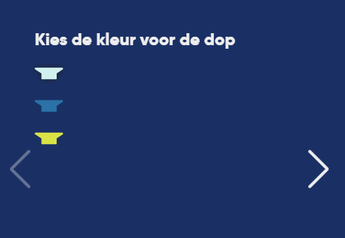
   
  #### oplossing:
  Ik heb het opgelost door in de @media een extra regel code toe te voegen, zodat de svg's op desktop groter worden, namelijk 3em ipv 2em.
  Dit was makkelijk om op te lossen, door ervoor te zorgen dat ik de juiste svg's geselecteerd had. Het goed centreren is niet helemaal gelukt.
  Omdat de bottles van de dopper zoveel hoogte in nemen, staan alle opties op desktop aan de hoge kant. Dit zou ik denk ik oplossen door het grid van de 
  bottles aan te passen naar 3 breed, alleen heb ik daar nu helaas de tijd niet meer voor. 
 
  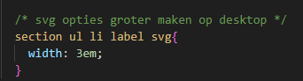
  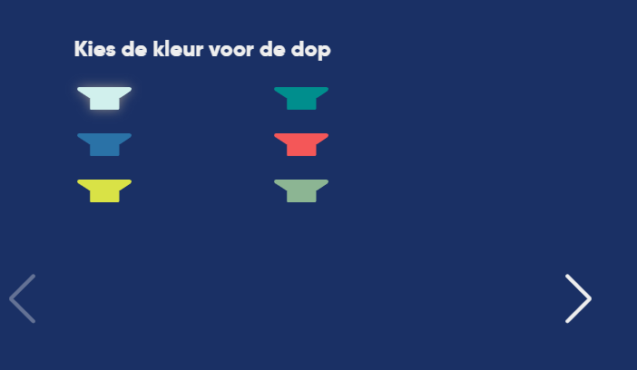

  ### Bevinding 2:
  Het grid klopt niet op desktop, de opties staan deels door elkaar. Dit komt denk ik omdat ik begonnen ben met het ontwerpen voor mobiel. 
  Daardoor ben ik later begonnen met desktop en heb ik nog niet alles kunnen aanpassen. Ik wil dit gaan oplossen door het grid minder breed te maken, 
  zodat hopelijk alle opties in een oogopslag zichtbaar zijn.

  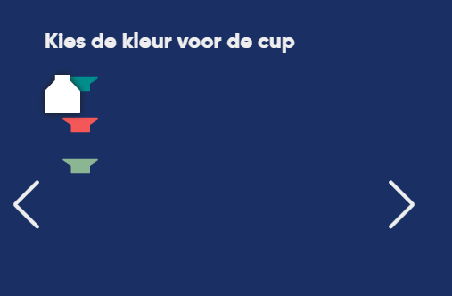

  #### oplossing:
  Na veel zoeken en uitproberen ben ik erachter gekomen waar de fout zat. Het grid had ik aangepast in de @media, maar had een vaste breedte meegekregen.
  Hierdoor was hij iets van 24em breed en de dopper 1fr. Dit heb ik aangepast naar fr, zodat de opties nu niet meer door elkaar lopen en het grid weer klopt. 

  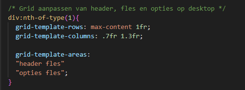
  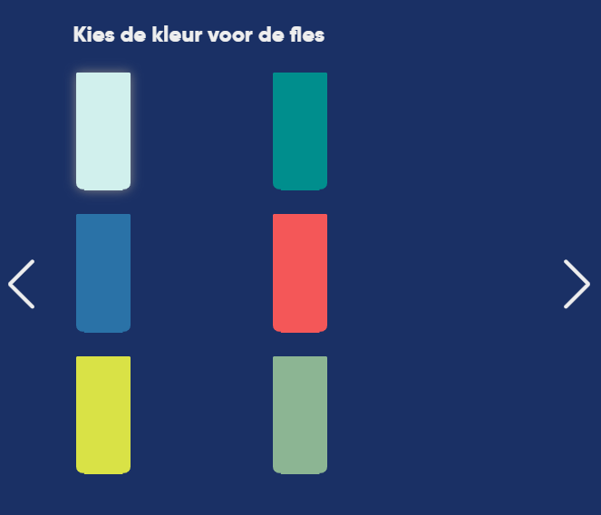

  ### Bevinding 3:
  Cupkleur kan op desktop niet aangepast worden. Dit komt eigenlijk door het probleem met het grid (bevinding 2). 
  Hierdoor staat momenteel alleen de witte (default) kleur cup bij de opties, omdat de zwarte is opgeschoven naar optie 3/4. 
  Ook dit hoop ik samen met bevinding 2 in een keer te kunnen oplossen, zodat het grid klopt en alle opties klikbaar zijn. 

  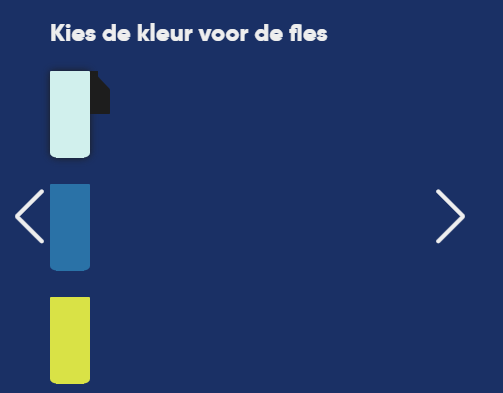

  #### oplossing:
  Dit heb ik opgelost met dezelfde code als bij oplossing 2 te zien is. Hiermee werden 2 vliegen in 1 klap opgelost. 
  Op de foto hieronder is te zien dat de cupkleur nu dus weer aangepast kan worden naar zwart. 

  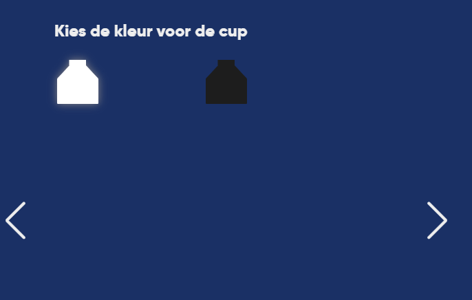

  ### Bevinding 4:
  Het toevoegen aan favorieten doet het soms wel soms niet, soms herlaad de pagina als je op de toevoegen button klikt. 
  Als je eventjes wacht bij stap 4/4 werkt het vaak wel (hier heb ik een schermopname van), zodra de body op mobiel geladen is. 
  Ook werkt de animatie niet dat het bolletje met het aantal groter wordt, zodra er iets wordt toegevoegd. 
  Voor het testen was ik ervan op de hoogte dat het toevoegen aan favorieten niet optimaal werkt. 
  Ik heb er op zaterdag al uren aan besteed, maar kom er gewoon niet achter waarom het niet werkt. 
  Ik zal proberen er nogmaals naar te kijken en het misschien op te lossen.

  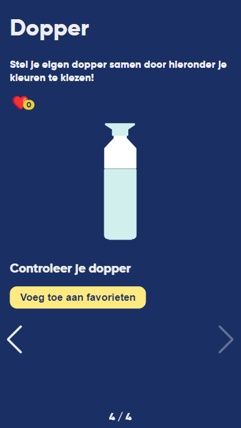

  
  #### oplossing:
  Ik heb alles gecontroleerd en snap echt niet waar de fout vandaan komt. Misschien is het iets heel simpels wat ik fout doe, maar misschien ook niet.
  Ik heb in ieder geval een schermopname op mijn telefoon, waarop te zien is dat het wel werkt. Maar op mijn laptop werkt het weer niet. 
  Op de afbeelding van de code is te zien waar ik denk dat de fout zit. Alleen weet ik niet wat er fout aan is en heb ik alles vaak nagelopen. 
  
  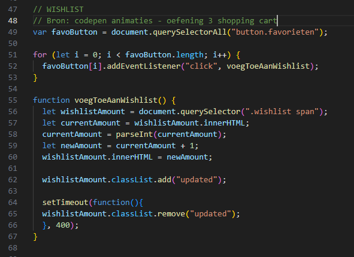

  ### Bevinding 5:
  De kleur coral splash voor bottle doet het niet. Ook van deze bevinding was ik voor het testen al op de hoogte.
  Ik heb alle namen overal meerdere malen gecontroleerd en ik snap niet waar dit probleem vandaan komt. 
  Ik zal nog een keer alles doornemen, zodat ik het hopelijk kan fixen. 

  

  #### oplossing:
  Ik heb heel erg vaak over mijn eigen fout heen gekeken. Ik wist dat ik coral vaak spelde als colar, maar dat was nu de fout niet.
  In mijn javascript code stond een typefout, namelijk coralp ipv coral. Na 5 keer alles doorgenomen te hebben, zag ik eindelijk de fout.
  Zoals op de afbeelding te zien is, kan de bottle kleur nu dus weer aangepast worden naar coral.

  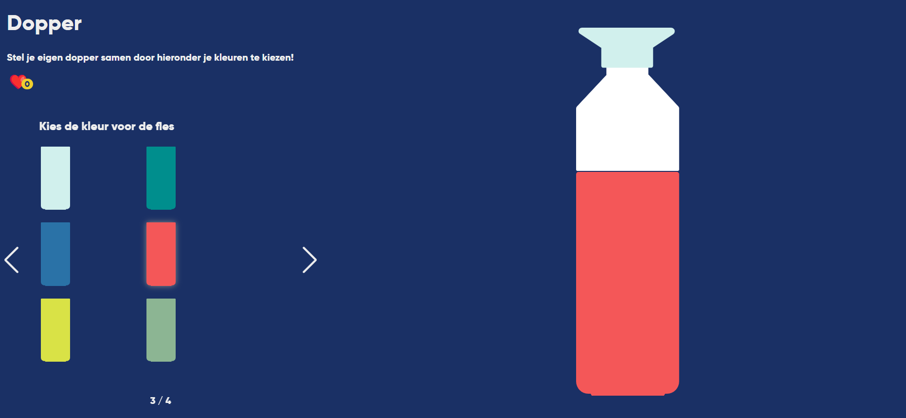

  ### Bevinding 6:
  Hartje op desktop groter maken. Ik kreeg te horen van Leon (mijn testpersoon uit project interaction) dat hij het hartje te klein vindt op desktop.
  Ik denk dat dit me wel moet lukken om aan te passen, ook hier zal ik mijn uiterste best voor doen. 

  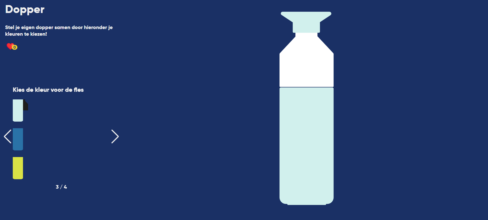

  #### oplossing:
  Deze bevinding heb ik best makkelijk kunnen oplossen, simpelweg in de @media extra code toegevoegd zodat het hartje groter is op desktop.
  Op de tweede afbeelding is te zien dat het hartje inderdaad nu beter zichtbaar is. 

  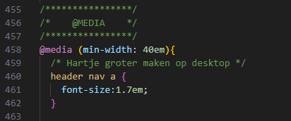
  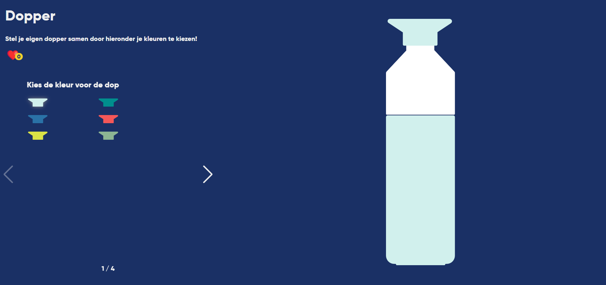

## Opdracht 2 reflectie

  
uitwerken bij afronden opdracht (voor week 8)

  ### Je uitkomst - karakteristiek screenshot(s):
  
  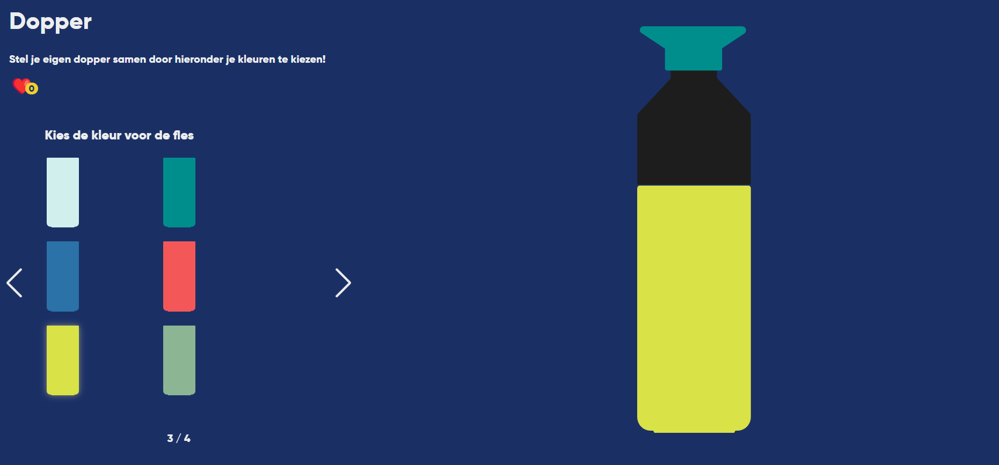
  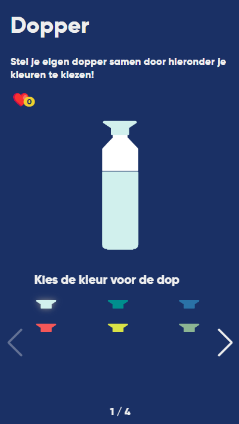
  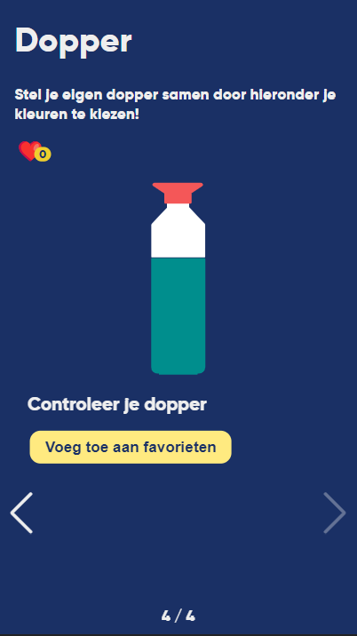

  ### Dit ging goed/Heb ik geleerd: 
  Wat als eerste best goed ging is het maken van een svg dopper in illustrator en de kleuren hiervan vervolgens aanpassen met code.
  Ook vind ik het leuk dat ik dit heb kunnen uitleggen aan een medestudent. 
  Voor mezelf had ik ook een stappenplan opgesteld, zodat ik het niet meer zal vergeten en eventueel later nog eens kan gebruiken.
  Daarnaast heb ik geleerd hoe ik de swiper heb kunnen toevoegen en begrijp ik al iets beter alle code die op de website wordt meegegeven.
  Verder heb ik ook geleerd aan de hand van een codepen van fed hoe een hartje een getal kan hebben wat opteld. 
  Dit leek mij erg lastig vooraf, maar het viel redelijk mee en is me zelfstandig (bijna) gelukt om werkend te krijgen.
  Dit is iets wat op vele andere plekken ook toegepast kan worden, zoals in een profiel of winkelmand. 
  Daarom vind ik het erg leuk dat ik nu een beter beeld heb gekregen hoe het werkt. 
  Wat ik verder nog heb geleerd is om soms eventjes rustig naar mijn code te kijken om te zien waar de fout vandaan komt. 
  Als ik iets heb gesloopt baal ik daar vaak enorm van en wil ik het zo snel mogelijk weer oplossen. 
  Maar soms kan ik dus beter even rustig mijn code doornemen om te zien wat de oorzaak is. 

  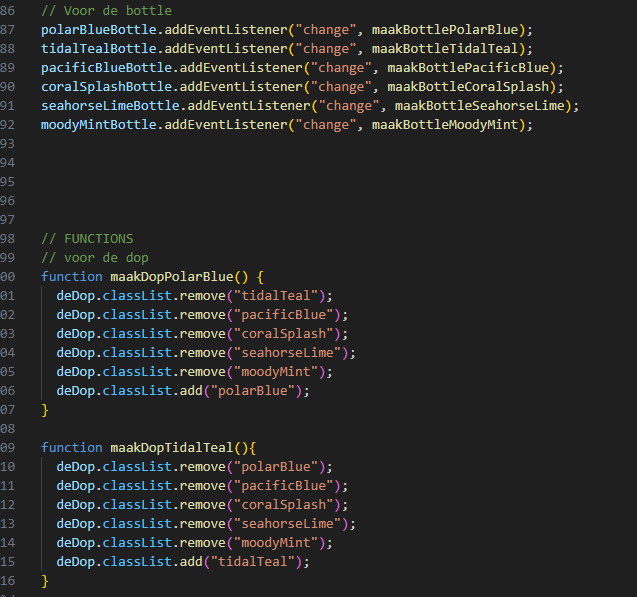
  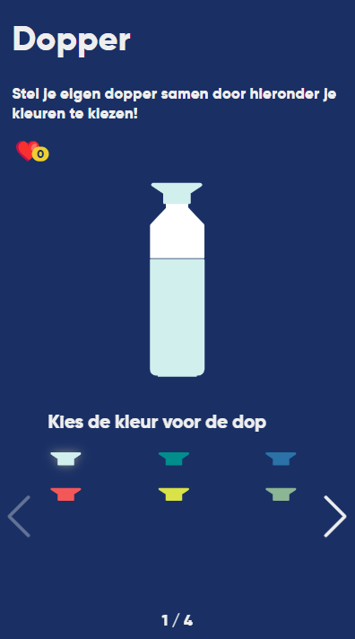

  ### Dit was lastig/Is niet gelukt:
  Vooraf had ik best wel veel plannen om met deze opdracht te gaan doen. Dit is helaas niet allemaal gelukt.
  Zo heb ik geen bubbel effect gemaakt voor de button en de fles niet vol laten stromen met water. 
  Beide heb ik niet kunnen proberen vanwege tijd tekort, maar het was mij misschien wel gelukt als ik kijk naar opdracht 1.
  Wat niet is gelukt is om het toevoegen aan favorieten helemaal goed werkend te krijgen, hier baal ik erg van. 
  Ik heb er veel tijd aan besteed en echt mijn best ervoor gedaan. Ik snap dan ook niet waardoor het soms wel en soms niet werkt. 
  Wel ben ik blij dat ik via de schermopname op mijn telefoon kan laten zien dat het wel heeft gewerkt.    
  Ook vind ik het jammer dat de keyframe met de animatie voor het toevoegen aan favorieten niet werkt.
  Ik snap niet hoe dit komt, omdat ik ook alles dubbel heb gecheckt met de codepen. 
  Als laatste vind ik het jammer dat ik de positie van de opties niet helemaal perfect heb kunnen krijgen.
  Ik ben nogal perfectionistisch en vind het op desktop momenteel niet op zijn mooist. 
  Hier heb ik ook van alles voor geprobeerd, maar niks heeft dus geholpen. 
  Misschien is dit zo op te lossen en misschien ook niet, maar ik heb er wel mijn best voor gedaan.
  Ik had graag meer aandacht willen besteden aan de light modus, deze vind ik niet heel mooi. 
  Ik werk zelf altijd in dark modus, vandaar dat ik deze wel mooier heb kunnen maken. 

  
  

