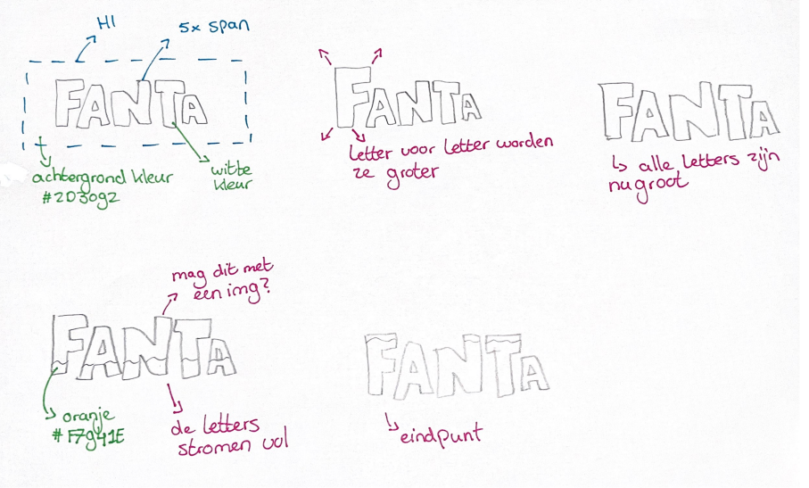
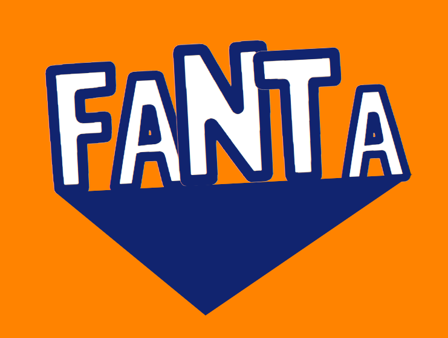
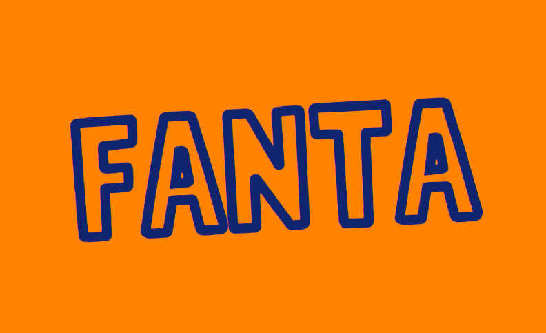
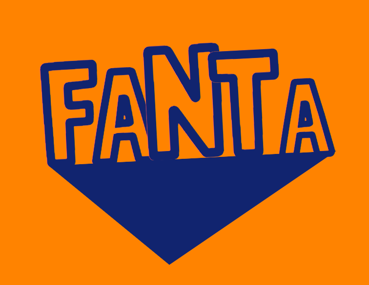
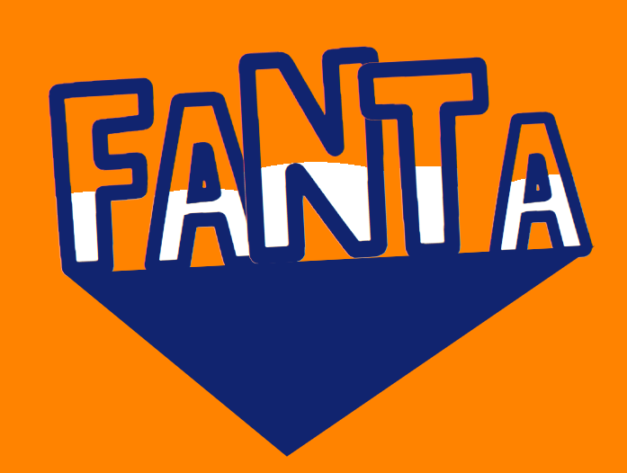
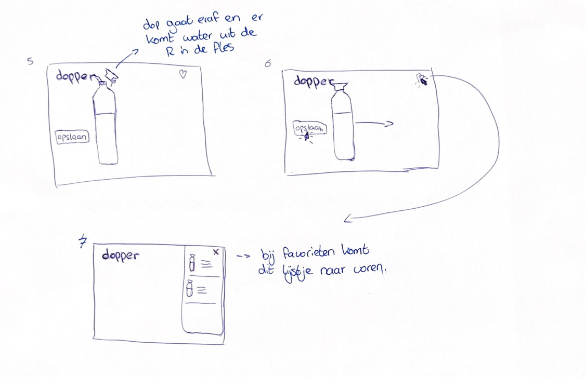

# Procesverslag
**Auteur:** Sanne Oosterhof

**De opdrachten:** [opdracht 1](opdracht1/index.html) en [opdracht 2](opdracht2/index.html)

Markdown is een simpele manier om HTML te schrijven.  
Markdown cheat cheet: [Hulp bij het schrijven van Markdown](https://github.com/adam-p/markdown-here/wiki/Markdown-Cheatsheet).

Nb. De standaardstructuur en de spartaanse opmaak van de README.md zijn helemaal prima. Het gaat om de inhoud van je procesverslag. Besteedt de tijd voor pracht en praal aan je website.

Nb. Door *open* toe te voegen aan een *details* element kun je deze standaard open zetten. Fijn om dat steeds voor de relevante stuk(ken) te doen.

## Bronnenlijst
  1. https://stackoverflow.com/questions/13426875/text-border-using-css-border-around-text (uiteindelijk niet meer gebruikt)
  2. https://codepen.io/shooft/pen/vYVjLvy  
  3. https://bennettfeely.com/clippy/
  4. https://www.fontsquirrel.com/tools/webfont-generator
  5. https://codepen.io/shooft/pen/GRXMEoV
  6. https://swiperjs.com/get-started#add-swiper-html-layout 

## Opdracht 1 plan

  
uitwerken na schetsen idee (voor week 2)

  ### Je storyboard:
  

  ### Je ambitie: 
  Aan deze technieken/punten wil ik werken:
  - Het vergroten van letters
  - De kenmerkende blauwe driehoek van Fanta onder de tekst laten verschijnen
  - De letters vol laten stromen
 

## Opdracht 1 reflectie

  
uitwerken bij afronden opdracht (voor week 4)

  ### Je uitkomst - karakteristiek screenshot(s):
  

  ### Dit ging goed/Heb ik geleerd: 
  Voor mij waren keyframes nog helemaal nieuw, 
  hier heb ik dus veel van geleerd. 
  Ook heb ik voor het eerst mijn eigen animatie gecodeerd, 
  dit vond ik erg leuk om te doen. 
  Nadat ik een storyboard had gemaakt kwam ik er al snel achter
  dat ik nog wat extra uitdaging zocht en met een before of after aan de slag wilde gaan. 
  Dit is uiteindelijk ook gelukt, waar ik veel van heb geleerd door ook fouten te maken. 

  
  

  ### Dit was lastig/Is niet gelukt:
  Ik vond het in het begin erg lastig om een logo te kiezen wat ik wilde animeren,
  omdat er zoveel keuze is. Ook vond ik het lastig een storyboard te maken van de animatie, 
  omdat ik niet goed wist wat voor mij haalbaar is om te coderen. 
  Het vol laten stromen van de letters was moeilijker dan ik had gedacht, omdat niks werkte wat ik probeerde. 
  Dit lag voornamelijk aan de manier waarop ik elementen selecteerde. Toen ik hier wat hulp bij kreeg is het uiteindelijk gelukt. 

  

## Opdracht 2 plan

  
uitwerken na schetsen idee (voor week 5)

  ### Je ontwerp:
  
  
  

  ### Je ambitie: 
  Aan deze technieken/punten wil ik werken:
  - Hover state van de button met een bubbel effect.
  - Doorklikken door de stappen zonder een nieuwe pagina aan te maken.
  - Favorieten lijstje. 
  - Dopper laten veranderen aan de hand van de keuzes die er gemaakt worden. 
  - De dopper laten verschuiven naar de R en weer terug. 
  - Water uit de R in de dopper laten stromen.

## Opdracht 2 test

  
uitwerken na testen (week 7)

  Neem minimaal 5 bevindingen op:

  ### Bevinding 1:
  Omschrijving van wat er nog niet orde was (tekst en afbeeding(en)).

  #### oplossing:
  Beschrijving hoe je het hebt hebt opgelost of als het niet gelukt is hoe je het zou oplossen (tekst en afbeeding(en)).

  ### Bevinding 2:
  Omschrijving van wat er nog niet orde was (tekst en afbeeding(en)).

  #### oplossing:
  Beschrijving hoe je het hebt hebt opgelost of als het niet gelukt is hoe je het zou oplossen (tekst en afbeeding(en)).

  ### Bevinding 3:
  ...

## Opdracht 2 reflectie

  
uitwerken bij afronden opdracht (voor week 8)

  ### Je uitkomst - karakteristiek screenshot(s):
  

  ### Dit ging goed/Heb ik geleerd: 
  Korte omschrijving met plaatje(s)

  

  ### Dit was lastig/Is niet gelukt:
  Korte omschrijving met plaatje(s)

  

