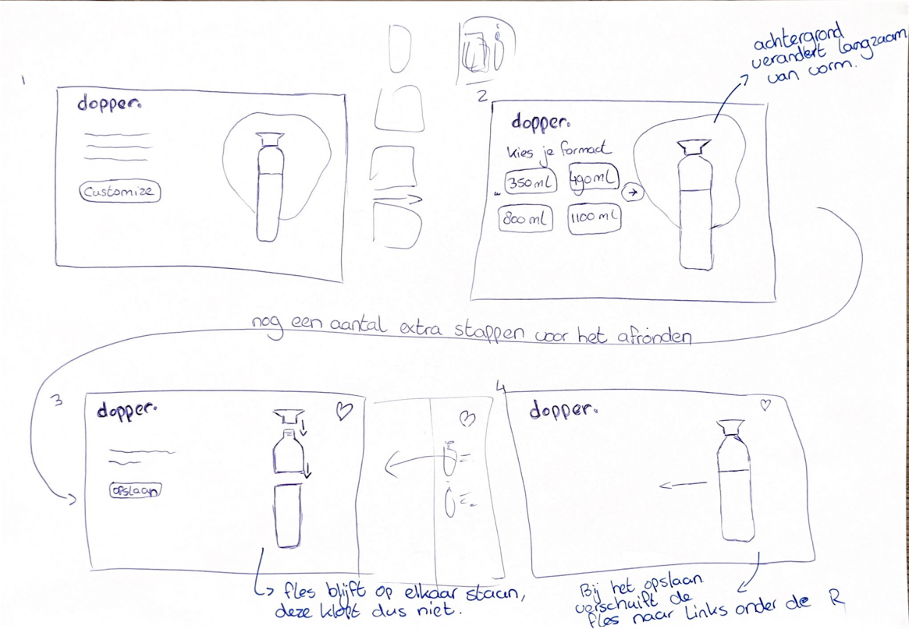
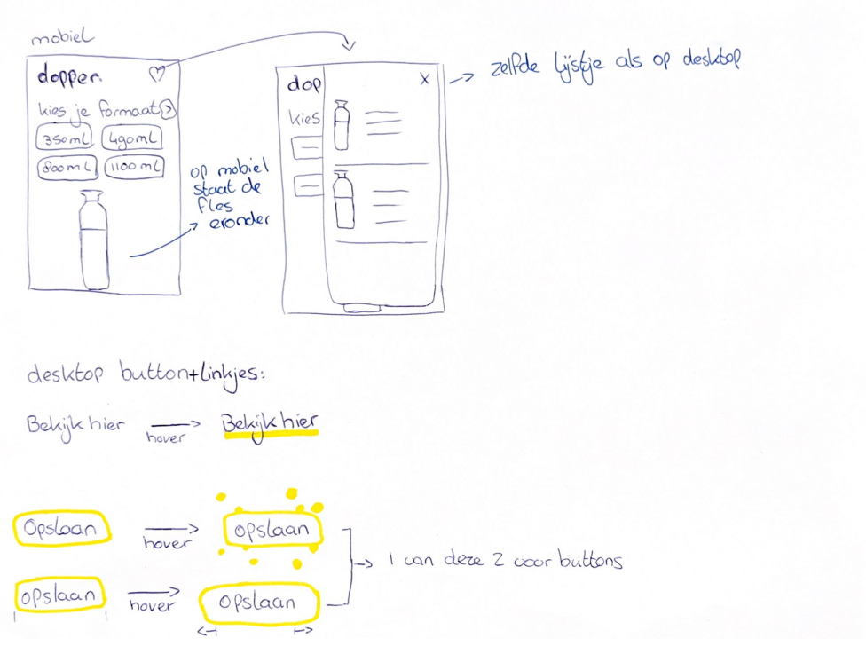

# Procesverslag
**Auteur:** Sanne Oosterhof

**De opdrachten:** [opdracht 1](opdracht1/index.html) en [opdracht 2](opdracht2/index.html)

Markdown is een simpele manier om HTML te schrijven.  
Markdown cheat cheet: [Hulp bij het schrijven van Markdown](https://github.com/adam-p/markdown-here/wiki/Markdown-Cheatsheet).

Nb. De standaardstructuur en de spartaanse opmaak van de README.md zijn helemaal prima. Het gaat om de inhoud van je procesverslag. Besteedt de tijd voor pracht en praal aan je website.

Nb. Door *open* toe te voegen aan een *details* element kun je deze standaard open zetten. Fijn om dat steeds voor de relevante stuk(ken) te doen.

## Bronnenlijst
  1. https://codepen.io/shooft/pen/vYVjLvy  
  2. https://bennettfeely.com/clippy/
  3. https://www.fontsquirrel.com/tools/webfont-generator
  4. https://codepen.io/shooft/pen/GRXMEoV
  5. https://swiperjs.com/get-started#add-swiper-html-layout 
  6. https://css-tricks.com/snippets/css/complete-guide-grid/ 

## Opdracht 1 plan

  
uitwerken na schetsen idee (voor week 2)

  ### Je storyboard:
  

  ### Je ambitie: 
  Aan deze technieken/punten wil ik werken:
  - Het vergroten van letters
  - De kenmerkende driehoek van Fanta onder de tekst laten verschijnen
  - De letters vol laten stromen
  - Een mooi dark/light schema ontwerpen
 

## Opdracht 1 reflectie

  
uitwerken bij afronden opdracht (voor week 4)

  ### Je uitkomst - karakteristiek screenshot(s):
  

  ### Dit ging goed/Heb ik geleerd: 
  Voor mij waren keyframes nog helemaal nieuw, hier heb ik dus veel van geleerd. 
  Keyframes gebruiken was eigenlijk makkelijker dan ik had gedacht, het is meer werk geweest voor mij om alles goed op elkaar af te stemmen.
  Denk bijvoorbeeld aan het vol laten stromen van de letters, de laatste A is eerder vol dan de andere letters. 
  Dit was niet moeilijk om te doen, maar vooral veel uitproberen en testen. 
  Zo heb ik uiteindelijk alle letters goed op elkaar kunnen afstemmen met het volstromen, dit ging best goed. 
  Ook vond ik het erg leuk om mijn eerste eigen animatie te maken en ontwerpen.
  Voordat ik begon met coderen voor opdracht 1 wist ik niet dat mijn animatie eigenlijk uit 3 losse animaties bestaat.
  Wat ik hiervan heb geleerd is om vooraf al beter te bepalen wat samen kan en wat los van elkaar komt te staan. 
  Nadat ik een storyboard had gemaakt kwam ik er al snel achter dat ik nog wat extra uitdaging zocht en met een before of after aan de slag wilde gaan. 
  Uiteindelijk heb ik een after gebruikt, waar ik voorheen nog nooit mee gewerkt had. 
  Vooraf dacht ik dat het veel moeilijker zou zijn om met een before/after te werken, maar dit vond ik erg meevallen. 
  Ik ben erg blij met het eindresultaat en had niet gedacht dat het toch zo mooi zou worden.

  
  

  ### Dit was lastig/Is niet gelukt:
  Ik vond het in het begin erg lastig om een logo te kiezen wat ik wilde animeren, omdat er zoveel keuze is. 
  Op Google heb ik onwijs veel logo's opgezocht en gekeken hoe ik deze zou kunnen animeren. 
  Ik heb op een gegeven moment de knoop doorgehakt om Fanta te kiezen, omdat ik al veel tijd kwijt was met het kiezen van een logo. 
  Ook vond ik het lastig een storyboard te maken van de animatie, omdat ik niet goed wist wat voor mij haalbaar is om te coderen. 
  Uiteindelijk heb ik maar een storyboard gemaakt wat mij leuk leek en tijdens het coderen gekeken wat haalbaar was en wat niet.
  Als ik naar het eindresultaat kijk is eigenlijk alles gelukt wat ik wilde doen en heb ik er zelfs nog een schepje bovenop kunnen doen.
  Het vol laten stromen van de letters was moeilijker dan ik had gedacht, omdat niks werkte wat ik probeerde. 
  Ik had veel voorbeelden opgezocht en dingen uitgeprobeerd, omdat het nog steeds niet werkte werd ik soms best wel gefrustreerd. 
  Dit lag voornamelijk aan de manier waarop ik elementen selecteerde. Toen ik hier hulp bij kreeg is het uiteindelijk gelukt. 

  

## Opdracht 2 plan

  
uitwerken na schetsen idee (voor week 5)

  ### Je ontwerp:
  
  
  

  ### Je ambitie: 
  Aan deze technieken/punten wil ik werken:
  - Hover state van de button met een bubbel effect.
  - Doorklikken door de stappen zonder een nieuwe pagina aan te maken.
  - Favorieten lijstje. 
  - Dopper laten veranderen aan de hand van de keuzes die er gemaakt worden. 
  - De dopper laten verschuiven naar de R en weer terug. 
  - Water uit de R in de dopper laten stromen.
  - Kleuren van een SVG met code veranderen.

## Opdracht 2 test

  
uitwerken na testen (week 7)

  Neem minimaal 5 bevindingen op:

  ### Bevinding 1:
  Omschrijving van wat er nog niet orde was (tekst en afbeeding(en)).

  #### oplossing:
  Beschrijving hoe je het hebt hebt opgelost of als het niet gelukt is hoe je het zou oplossen (tekst en afbeeding(en)).

  ### Bevinding 2:
  Omschrijving van wat er nog niet orde was (tekst en afbeeding(en)).

  #### oplossing:
  Beschrijving hoe je het hebt hebt opgelost of als het niet gelukt is hoe je het zou oplossen (tekst en afbeeding(en)).

  ### Bevinding 3:
  ...

## Opdracht 2 reflectie

  
uitwerken bij afronden opdracht (voor week 8)

  ### Je uitkomst - karakteristiek screenshot(s):
  

  ### Dit ging goed/Heb ik geleerd: 
  Korte omschrijving met plaatje(s)

  

  ### Dit was lastig/Is niet gelukt:
  Korte omschrijving met plaatje(s)

  

